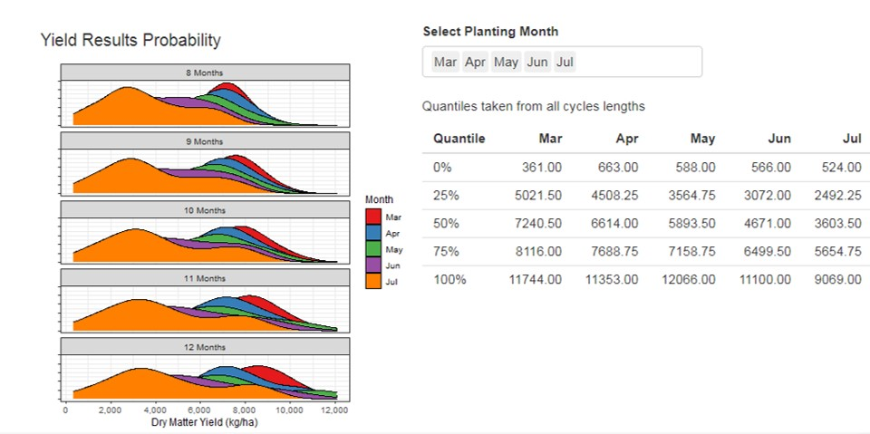
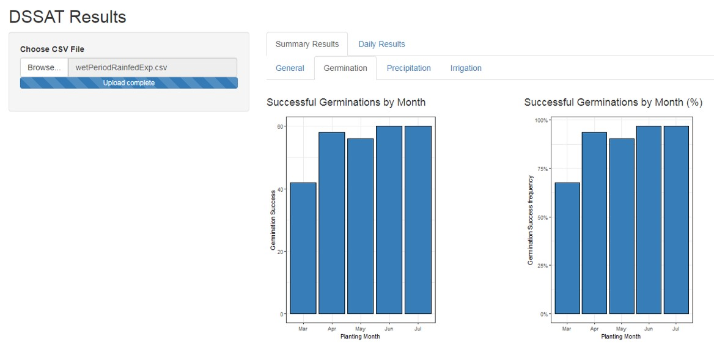
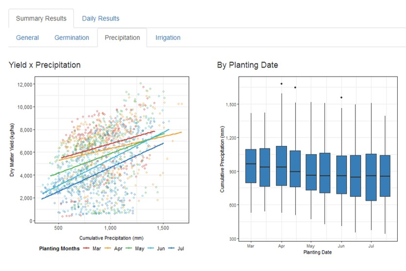
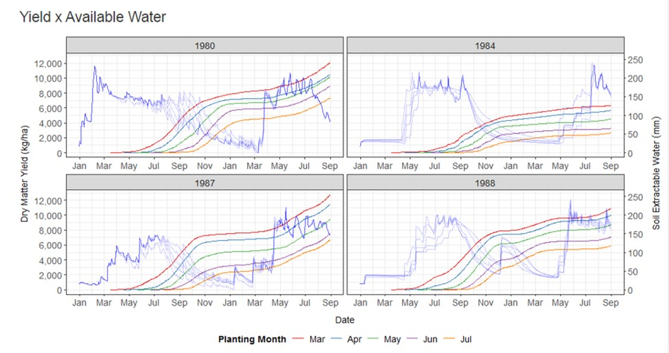

## Shiny App to automate simulation results analysis

Under development. See below some app screenshots.

-------------------------------------------

<h1 align="center">
    
</h1>

<h1 align="center">
    
</h1>

<h1 align="center">
    
</h1>

<h1 align="center">
    
</h1>
